# auth-account — Flows tái lập (reverse)

> Chỉ vẽ bước CÓ trong code. Bước suy đoán chú thích 🟡. Nguồn mỗi flow nằm dưới tiêu đề (đường dẫn repo đầy đủ). Chi tiết lỗi: `auth-account-reverse-spec.md` Mục 6.

## Flow 1: Đăng ký bằng email + mật khẩu

> Nguồn ✅: apps/web/src/features/auth/auth-screen.tsx:118-143; packages/auth/src/index.ts:34-37; packages/api/src/test/auth.test.ts:59-87,257-284. Liên quan FR-001..005, FR-012, E-002, E-004, E-005.

### Sequence — Đăng ký bằng email

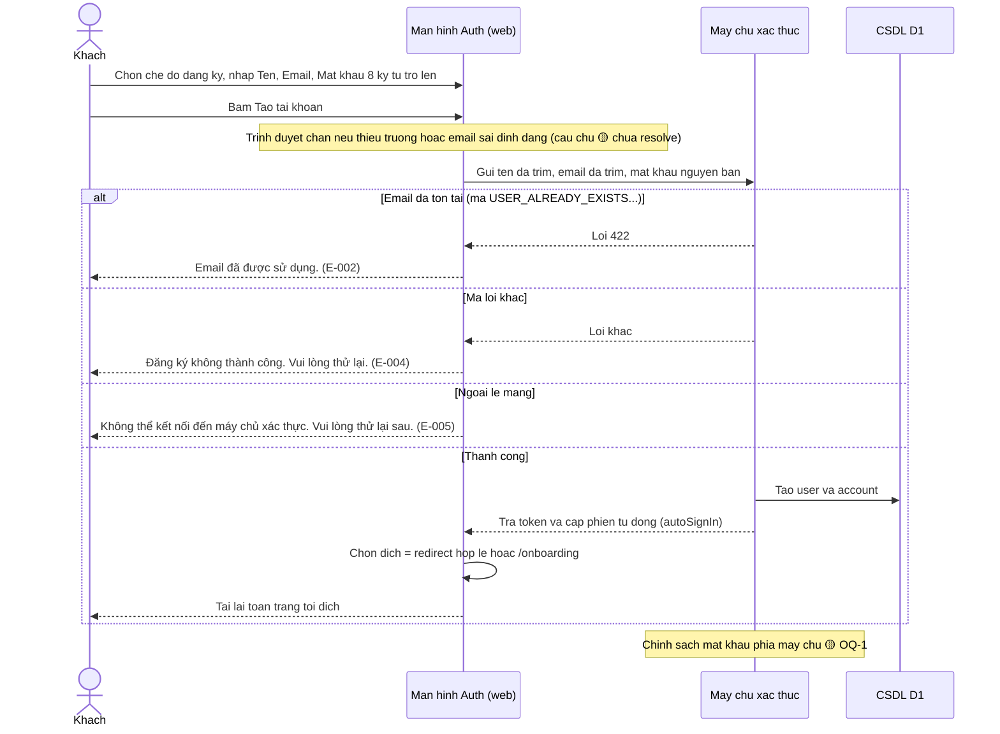
```mermaid
sequenceDiagram
    actor K as Khach
    participant W as Man hinh Auth (web)
    participant S as May chu xac thuc
    participant D as CSDL D1
    K->>W: Chon che do dang ky, nhap Ten, Email, Mat khau 8 ky tu tro len
    K->>W: Bam Tao tai khoan
    Note over W: Trinh duyet chan neu thieu truong hoac email sai dinh dang (cau chu 🟡 chua resolve)
    W->>S: Gui ten da trim, email da trim, mat khau nguyen ban
    alt Email da ton tai (ma USER_ALREADY_EXISTS...)
        S-->>W: Loi 422
        W-->>K: Email đã được sử dụng. (E-002)
    else Ma loi khac
        S-->>W: Loi khac
        W-->>K: Đăng ký không thành công. Vui lòng thử lại. (E-004)
    else Ngoai le mang
        W-->>K: Không thể kết nối đến máy chủ xác thực. Vui lòng thử lại sau. (E-005)
    else Thanh cong
        S->>D: Tao user va account
        S-->>W: Tra token va cap phien tu dong (autoSignIn)
        W->>W: Chon dich = redirect hop le hoac /onboarding
        W-->>K: Tai lai toan trang toi dich
    end
    Note over S: Chinh sach mat khau phia may chu 🟡 OQ-1
```

### Activity — Đăng ký bằng email

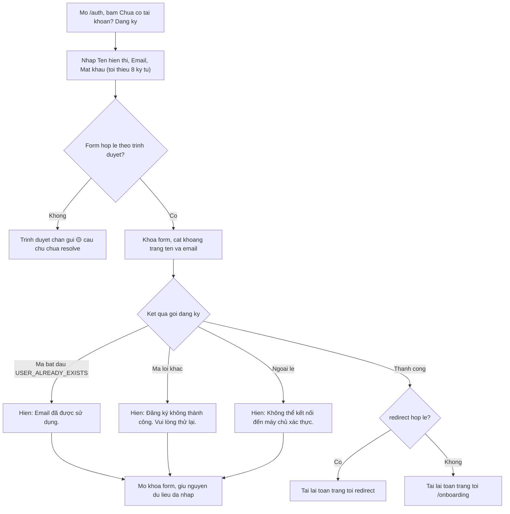
```mermaid
flowchart TD
    A["Mo /auth, bam Chua co tai khoan? Dang ky"] --> B["Nhap Ten hien thi, Email, Mat khau (toi thieu 8 ky tu)"]
    B --> C{"Form hop le theo trinh duyet?"}
    C -->|Khong| C1["Trinh duyet chan gui 🟡 cau chu chua resolve"]
    C -->|Co| D["Khoa form, cat khoang trang ten va email"]
    D --> E{"Ket qua goi dang ky"}
    E -->|"Ma bat dau USER_ALREADY_EXISTS"| E1["Hien: Email đã được sử dụng."]
    E -->|"Ma loi khac"| E2["Hien: Đăng ký không thành công. Vui lòng thử lại."]
    E -->|"Ngoai le"| E3["Hien: Không thể kết nối đến máy chủ xác thực."]
    E -->|"Thanh cong"| F{"redirect hop le?"}
    F -->|Co| F1["Tai lai toan trang toi redirect"]
    F -->|Khong| F2["Tai lai toan trang toi /onboarding"]
    E1 --> G["Mo khoa form, giu nguyen du lieu da nhap"]
    E2 --> G
    E3 --> G
```

## Flow 2: Đăng nhập bằng email + mật khẩu

> Nguồn ✅: apps/web/src/features/auth/auth-screen.tsx:118-143; packages/api/src/test/auth.test.ts:67-87,195-221. Liên quan FR-006..009, FR-012, E-001, E-003, E-005.

### Sequence — Đăng nhập bằng email

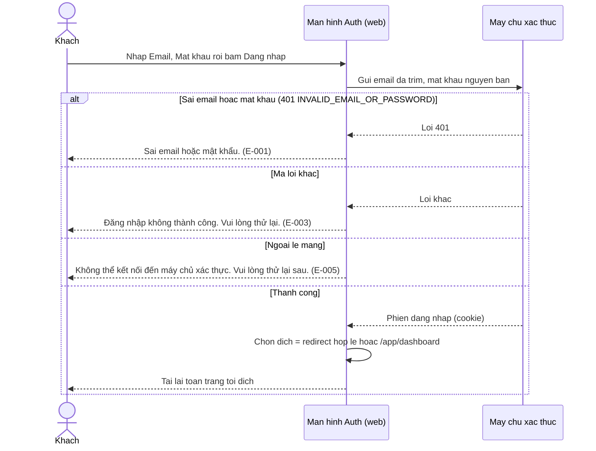
```mermaid
sequenceDiagram
    actor K as Khach
    participant W as Man hinh Auth (web)
    participant S as May chu xac thuc
    K->>W: Nhap Email, Mat khau roi bam Dang nhap
    W->>S: Gui email da trim, mat khau nguyen ban
    alt Sai email hoac mat khau (401 INVALID_EMAIL_OR_PASSWORD)
        S-->>W: Loi 401
        W-->>K: Sai email hoặc mật khẩu. (E-001)
    else Ma loi khac
        S-->>W: Loi khac
        W-->>K: Đăng nhập không thành công. Vui lòng thử lại. (E-003)
    else Ngoai le mang
        W-->>K: Không thể kết nối đến máy chủ xác thực. Vui lòng thử lại sau. (E-005)
    else Thanh cong
        S-->>W: Phien dang nhap (cookie)
        W->>W: Chon dich = redirect hop le hoac /app/dashboard
        W-->>K: Tai lai toan trang toi dich
    end
```

### Activity — Đăng nhập bằng email

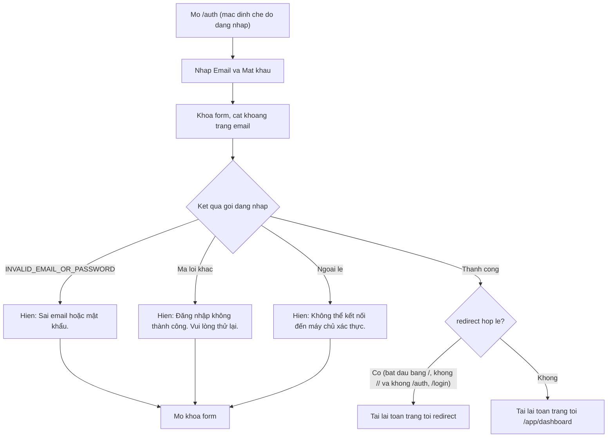
```mermaid
flowchart TD
    A["Mo /auth (mac dinh che do dang nhap)"] --> B["Nhap Email va Mat khau"]
    B --> C["Khoa form, cat khoang trang email"]
    C --> D{"Ket qua goi dang nhap"}
    D -->|"INVALID_EMAIL_OR_PASSWORD"| D1["Hien: Sai email hoặc mật khẩu."]
    D -->|"Ma loi khac"| D2["Hien: Đăng nhập không thành công. Vui lòng thử lại."]
    D -->|"Ngoai le"| D3["Hien: Không thể kết nối đến máy chủ xác thực."]
    D -->|"Thanh cong"| E{"redirect hop le?"}
    E -->|"Co (bat dau bang /, khong // va khong /auth, /login)"| E1["Tai lai toan trang toi redirect"]
    E -->|Khong| E2["Tai lai toan trang toi /app/dashboard"]
    D1 --> F["Mo khoa form"]
    D2 --> F
    D3 --> F
```

## Flow 3: Đăng nhập bằng Google

> Nguồn ✅: apps/web/src/features/auth/auth-screen.tsx:75-116; packages/auth/src/index.ts:38-43; packages/api/src/test/auth.test.ts:31-57; apps/web/src/features/__tests__/slice-a.test.tsx:661-764. Liên quan FR-013, FR-014, E-005..E-008. Bước Google chấp thuận/hủy diễn ra ngoài hệ thống — chỉ biết kết quả qua tham số `error`; các bước thư viện/Google bên dưới là 🟡 (chưa xác nhận từ repo).

### Sequence — Đăng nhập Google

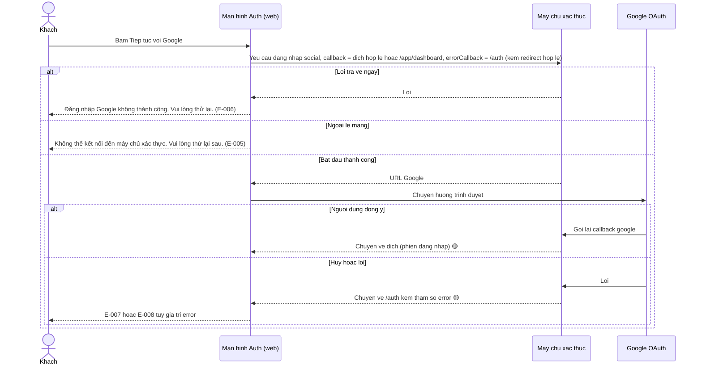
```mermaid
sequenceDiagram
    actor K as Khach
    participant W as Man hinh Auth (web)
    participant S as May chu xac thuc
    participant G as Google OAuth
    K->>W: Bam Tiep tuc voi Google
    W->>S: Yeu cau dang nhap social, callback = dich hop le hoac /app/dashboard, errorCallback = /auth (kem redirect hop le)
    alt Loi tra ve ngay
        S-->>W: Loi
        W-->>K: Đăng nhập Google không thành công. Vui lòng thử lại. (E-006)
    else Ngoai le mang
        W-->>K: Không thể kết nối đến máy chủ xác thực. Vui lòng thử lại sau. (E-005)
    else Bat dau thanh cong
        S-->>W: URL Google
        W->>G: Chuyen huong trinh duyet
        alt Nguoi dung dong y
            G->>S: Goi lai callback google
            S-->>W: Chuyen ve dich (phien dang nhap) 🟡
        else Huy hoac loi
            G->>S: Loi
            S-->>W: Chuyen ve /auth kem tham so error 🟡
            W-->>K: E-007 hoac E-008 tuy gia tri error
        end
    end
```

### Activity — Đăng nhập Google

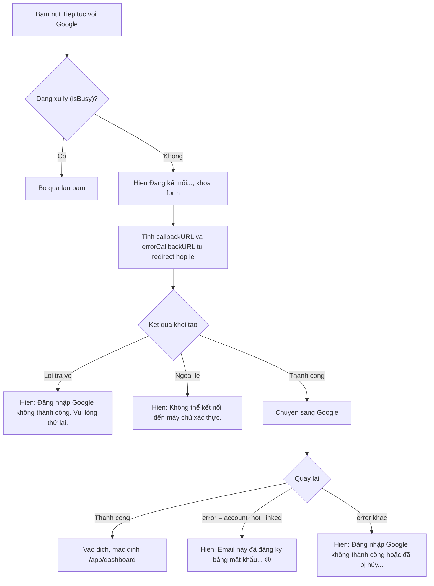
```mermaid
flowchart TD
    A["Bam nut Tiep tuc voi Google"] --> B{"Dang xu ly (isBusy)?"}
    B -->|Co| B1["Bo qua lan bam"]
    B -->|Khong| C["Hien Đang kết nối..., khoa form"]
    C --> D["Tinh callbackURL va errorCallbackURL tu redirect hop le"]
    D --> E{"Ket qua khoi tao"}
    E -->|"Loi tra ve"| E1["Hien: Đăng nhập Google không thành công. Vui lòng thử lại."]
    E -->|"Ngoai le"| E2["Hien: Không thể kết nối đến máy chủ xác thực."]
    E -->|"Thanh cong"| F["Chuyen sang Google"]
    F --> G{"Quay lai"}
    G -->|"Thanh cong"| G1["Vao dich, mac dinh /app/dashboard"]
    G -->|"error = account_not_linked"| G2["Hien: Email này đã đăng ký bằng mật khẩu... 🟡"]
    G -->|"error khac"| G3["Hien: Đăng nhập Google không thành công hoặc đã bị hủy..."]
```

## Flow 4: Đăng xuất

> Nguồn ✅: apps/web/src/hooks/use-sign-out.ts:10-31; apps/web/src/features/app-state/use-profile-hydration.ts:30-40; apps/web/src/hooks/__tests__/use-sign-out.test.tsx:37-90. Liên quan FR-016..018, E-009.

### Sequence — Đăng xuất

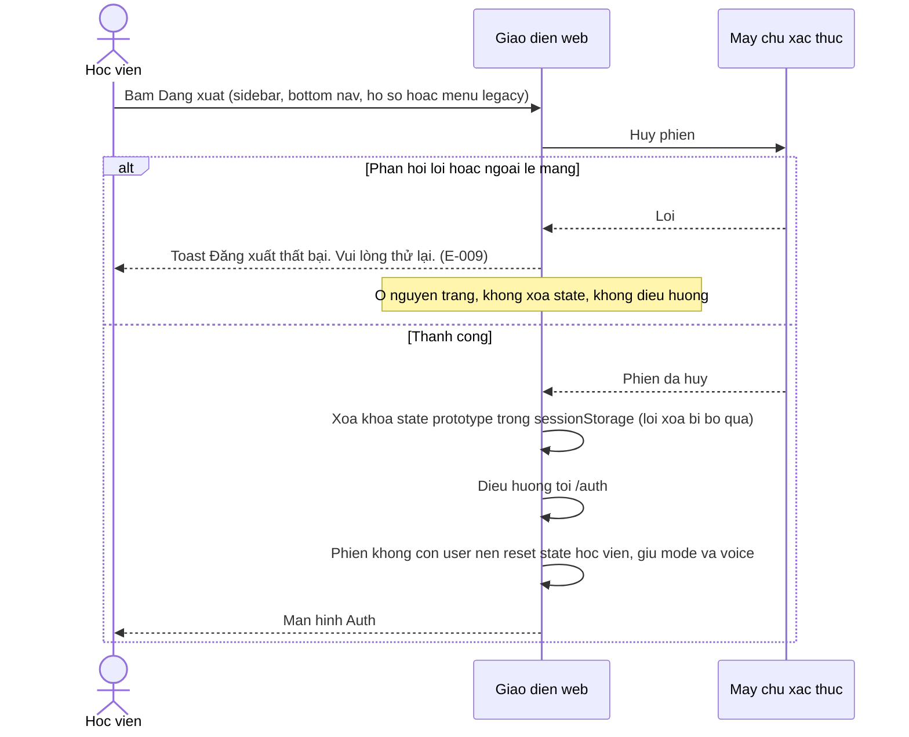
```mermaid
sequenceDiagram
    actor H as Hoc vien
    participant W as Giao dien web
    participant S as May chu xac thuc
    H->>W: Bam Dang xuat (sidebar, bottom nav, ho so hoac menu legacy)
    W->>S: Huy phien
    alt Phan hoi loi hoac ngoai le mang
        S-->>W: Loi
        W-->>H: Toast Đăng xuất thất bại. Vui lòng thử lại. (E-009)
        Note over W: O nguyen trang, khong xoa state, khong dieu huong
    else Thanh cong
        S-->>W: Phien da huy
        W->>W: Xoa khoa state prototype trong sessionStorage (loi xoa bi bo qua)
        W->>W: Dieu huong toi /auth
        W->>W: Phien khong con user nen reset state hoc vien, giu mode va voice
        W-->>H: Man hinh Auth
    end
```

### Activity — Đăng xuất

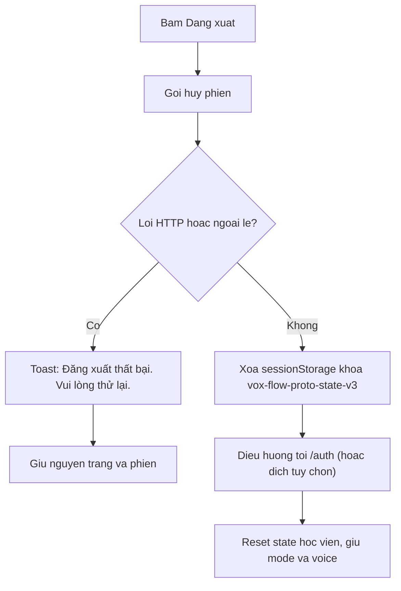
```mermaid
flowchart TD
    A["Bam Dang xuat"] --> B["Goi huy phien"]
    B --> C{"Loi HTTP hoac ngoai le?"}
    C -->|Co| C1["Toast: Đăng xuất thất bại. Vui lòng thử lại."]
    C1 --> C2["Giu nguyen trang va phien"]
    C -->|Khong| D["Xoa sessionStorage khoa vox-flow-proto-state-v3"]
    D --> E["Dieu huong toi /auth (hoac dich tuy chon)"]
    E --> F["Reset state hoc vien, giu mode va voice"]
```

## Flow 5: Bảo vệ route theo phiên và onboarding

> Nguồn ✅: apps/web/src/lib/auth-guard.ts:24-70; apps/web/src/routes/_proto/app/route.tsx:7; apps/web/src/routes/_proto/onboarding.tsx:7-26; apps/web/src/lib/__tests__/auth-guard.test.ts; apps/web/src/lib/__tests__/route-guards.test.ts. Liên quan FR-019..023.

### Sequence — Guard route

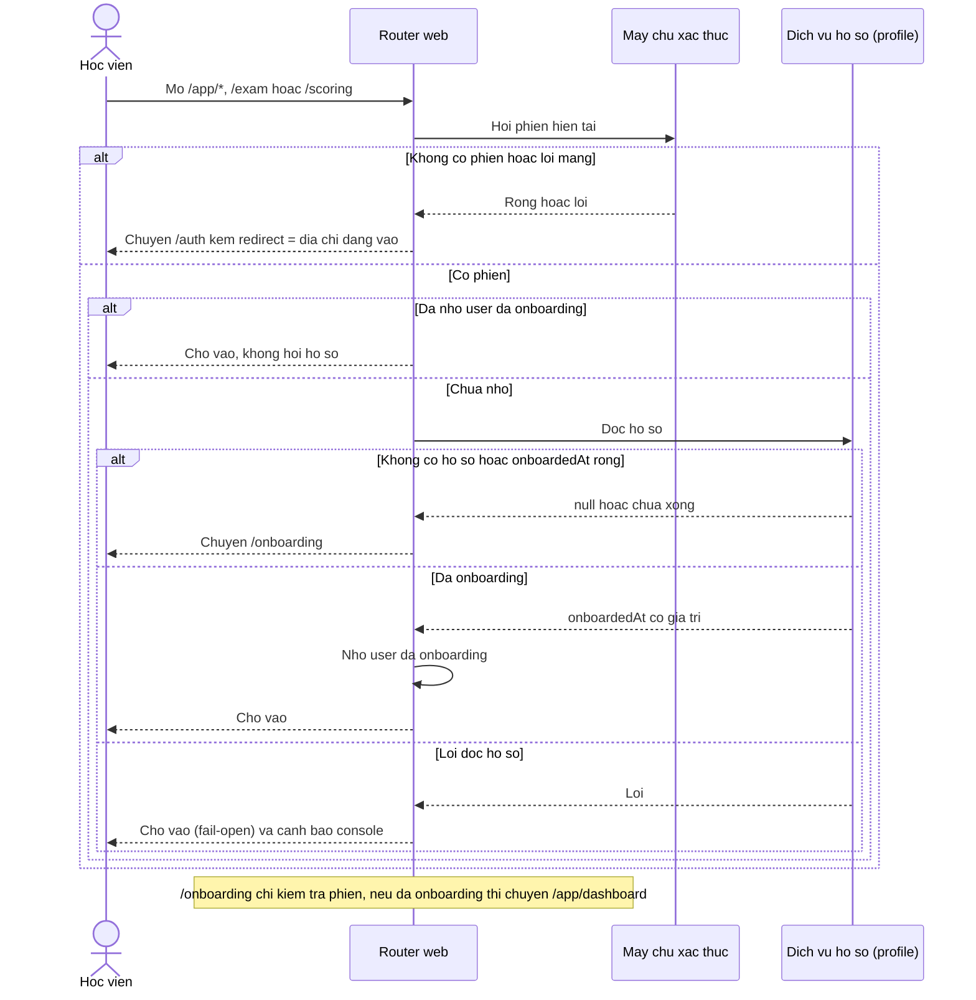
```mermaid
sequenceDiagram
    actor H as Hoc vien
    participant R as Router web
    participant S as May chu xac thuc
    participant P as Dich vu ho so (profile)
    H->>R: Mo /app/*, /exam hoac /scoring
    R->>S: Hoi phien hien tai
    alt Khong co phien hoac loi mang
        S-->>R: Rong hoac loi
        R-->>H: Chuyen /auth kem redirect = dia chi dang vao
    else Co phien
        alt Da nho user da onboarding
            R-->>H: Cho vao, khong hoi ho so
        else Chua nho
            R->>P: Doc ho so
            alt Khong co ho so hoac onboardedAt rong
                P-->>R: null hoac chua xong
                R-->>H: Chuyen /onboarding
            else Da onboarding
                P-->>R: onboardedAt co gia tri
                R->>R: Nho user da onboarding
                R-->>H: Cho vao
            else Loi doc ho so
                P-->>R: Loi
                R-->>H: Cho vao (fail-open) va canh bao console
            end
        end
    end
    Note over R: /onboarding chi kiem tra phien, neu da onboarding thi chuyen /app/dashboard
```

### Activity — Guard route

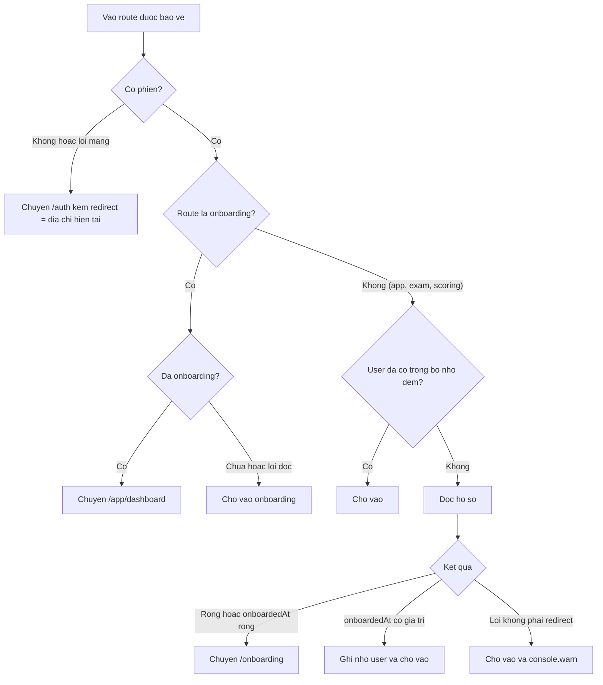
```mermaid
flowchart TD
    A["Vao route duoc bao ve"] --> B{"Co phien?"}
    B -->|"Khong hoac loi mang"| B1["Chuyen /auth kem redirect = dia chi hien tai"]
    B -->|Co| C{"Route la onboarding?"}
    C -->|Co| D{"Da onboarding?"}
    D -->|Co| D1["Chuyen /app/dashboard"]
    D -->|"Chua hoac loi doc"| D2["Cho vao onboarding"]
    C -->|"Khong (app, exam, scoring)"| E{"User da co trong bo nho dem?"}
    E -->|Co| E1["Cho vao"]
    E -->|Khong| F["Doc ho so"]
    F --> G{"Ket qua"}
    G -->|"Rong hoac onboardedAt rong"| G1["Chuyen /onboarding"]
    G -->|"onboardedAt co gia tri"| G2["Ghi nho user va cho vao"]
    G -->|"Loi khong phai redirect"| G3["Cho vao va console.warn"]
```

## Flow 6: Truy cập khu vực quản trị

> Nguồn ✅: apps/web/src/routes/admin/disputes.tsx:7-29; apps/web/src/routes/admin/forecast.tsx:7-29; packages/api/src/index.ts:31-45; packages/api/src/auth-utils.ts:1-13. Liên quan FR-024, FR-026, E-011.

### Sequence — Khu quản trị

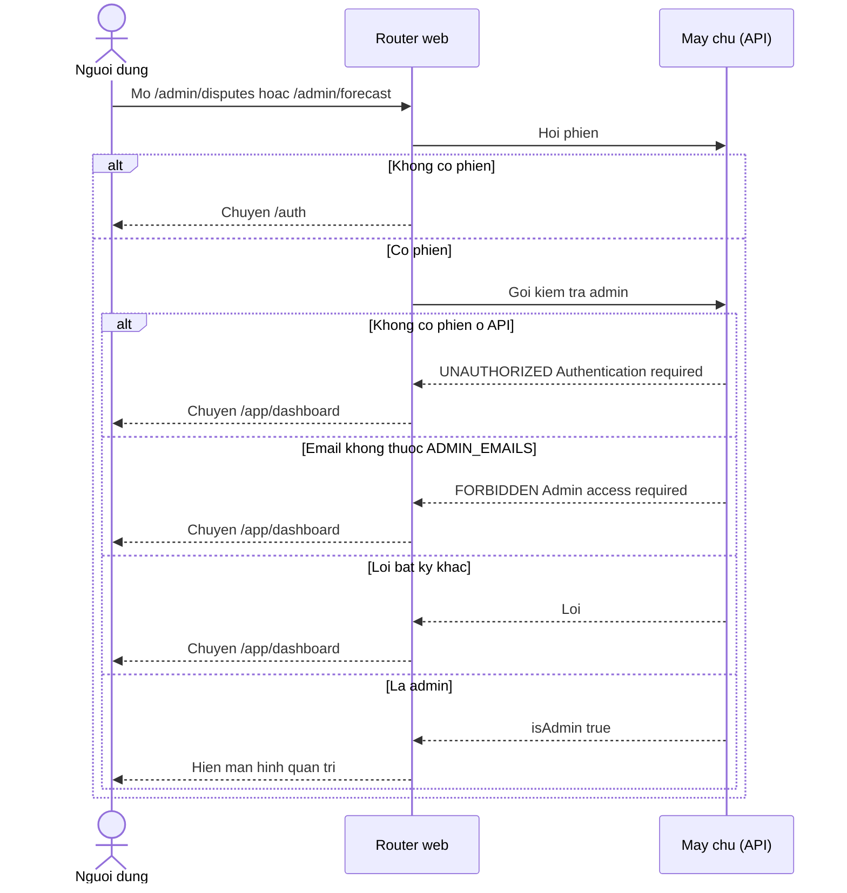
```mermaid
sequenceDiagram
    actor Q as Nguoi dung
    participant R as Router web
    participant S as May chu (API)
    Q->>R: Mo /admin/disputes hoac /admin/forecast
    R->>S: Hoi phien
    alt Khong co phien
        R-->>Q: Chuyen /auth
    else Co phien
        R->>S: Goi kiem tra admin
        alt Khong co phien o API
            S-->>R: UNAUTHORIZED Authentication required
            R-->>Q: Chuyen /app/dashboard
        else Email khong thuoc ADMIN_EMAILS
            S-->>R: FORBIDDEN Admin access required
            R-->>Q: Chuyen /app/dashboard
        else Loi bat ky khac
            S-->>R: Loi
            R-->>Q: Chuyen /app/dashboard
        else La admin
            S-->>R: isAdmin true
            R-->>Q: Hien man hinh quan tri
        end
    end
```

### Activity — Khu quản trị

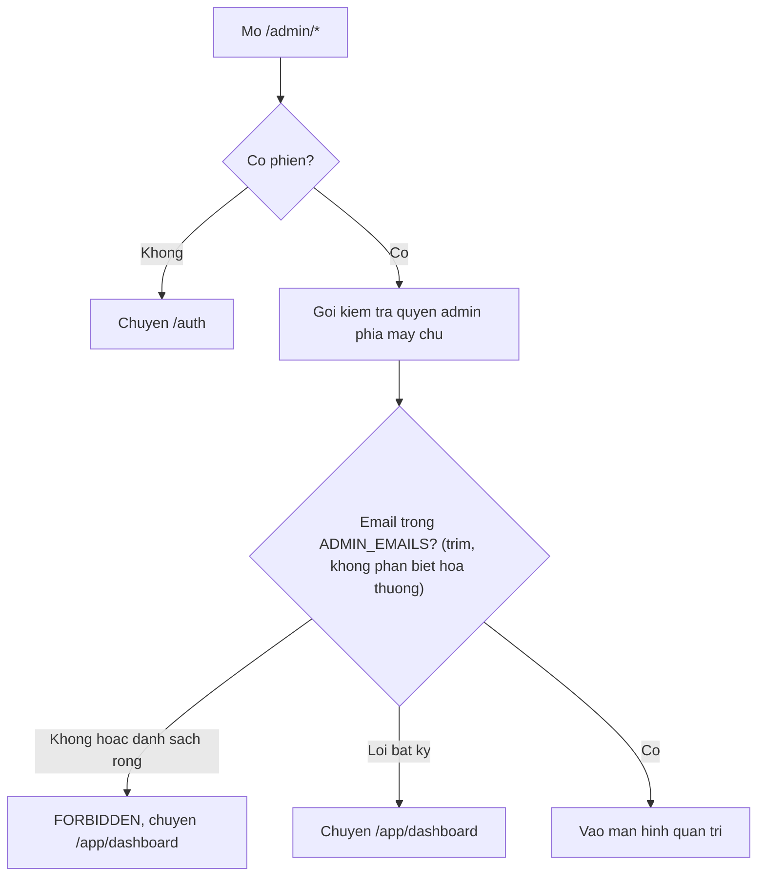
```mermaid
flowchart TD
    A["Mo /admin/*"] --> B{"Co phien?"}
    B -->|Khong| B1["Chuyen /auth"]
    B -->|Co| C["Goi kiem tra quyen admin phia may chu"]
    C --> D{"Email trong ADMIN_EMAILS? (trim, khong phan biet hoa thuong)"}
    D -->|"Khong hoac danh sach rong"| D1["FORBIDDEN, chuyen /app/dashboard"]
    D -->|"Loi bat ky"| D2["Chuyen /app/dashboard"]
    D -->|Co| E["Vao man hinh quan tri"]
```

## Flow 7: Hợp lệ hóa ảnh đại diện khi tạo/cập nhật tài khoản

> Nguồn ✅: packages/auth/src/image-validation.ts:17-31; packages/auth/src/index.ts:46-72; packages/api/src/test/auth.test.ts:89-193. Liên quan FR-028, BR-009..017, E-012. Chỉ phần kiểm tra — luồng chọn/nén avatar thuộc `onboarding-profile`.

### Sequence — Hợp lệ hóa ảnh

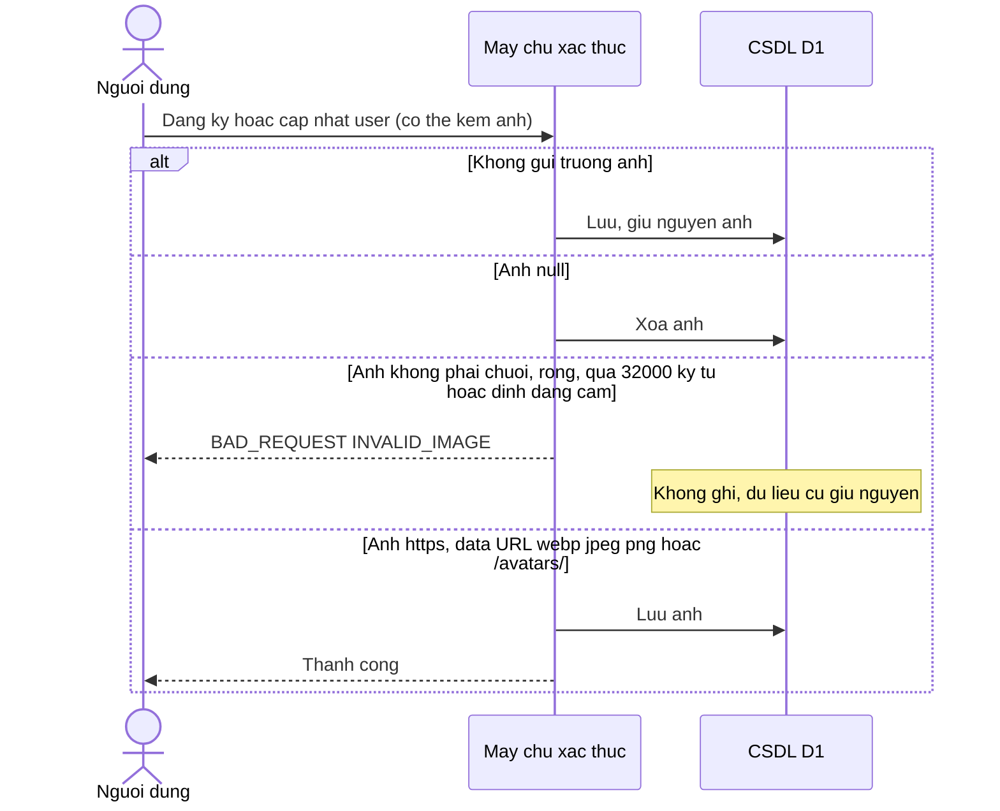
```mermaid
sequenceDiagram
    actor N as Nguoi dung
    participant S as May chu xac thuc
    participant D as CSDL D1
    N->>S: Dang ky hoac cap nhat user (co the kem anh)
    alt Khong gui truong anh
        S->>D: Luu, giu nguyen anh
    else Anh null
        S->>D: Xoa anh
    else Anh khong phai chuoi, rong, qua 32000 ky tu hoac dinh dang cam
        S-->>N: BAD_REQUEST INVALID_IMAGE
        Note over D: Khong ghi, du lieu cu giu nguyen
    else Anh https, data URL webp jpeg png hoac /avatars/
        S->>D: Luu anh
        S-->>N: Thanh cong
    end
```

### Activity — Hợp lệ hóa ảnh

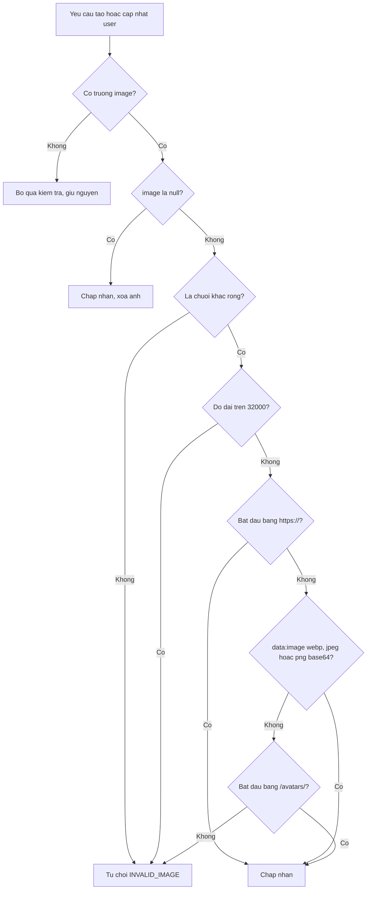
```mermaid
flowchart TD
    A["Yeu cau tao hoac cap nhat user"] --> B{"Co truong image?"}
    B -->|Khong| B1["Bo qua kiem tra, giu nguyen"]
    B -->|Co| C{"image la null?"}
    C -->|Co| C1["Chap nhan, xoa anh"]
    C -->|Khong| D{"La chuoi khac rong?"}
    D -->|Khong| X["Tu choi INVALID_IMAGE"]
    D -->|Co| E{"Do dai tren 32000?"}
    E -->|Co| X
    E -->|Khong| F{"Bat dau bang https://?"}
    F -->|Co| OK["Chap nhan"]
    F -->|Khong| G{"data:image webp, jpeg hoac png base64?"}
    G -->|Co| OK
    G -->|Khong| H{"Bat dau bang /avatars/?"}
    H -->|Co| OK
    H -->|Khong| X
```

## Flow 8: Khu vực legacy — đăng nhập và dashboard cũ (🟡 nghi dead)

> Nguồn: apps/web/src/routes/_app-legacy/login.tsx:11-18; apps/web/src/routes/_app-legacy/_auth/route.tsx:5-16; apps/web/src/routes/_app-legacy/_auth/dashboard.tsx:10-21; apps/web/src/components/sign-in-form.tsx; apps/web/src/components/sign-up-form.tsx. Không có test, không có liên kết từ giao diện chính (xem `reverse-gaps.md` N-4). 🟡

### Sequence — Legacy

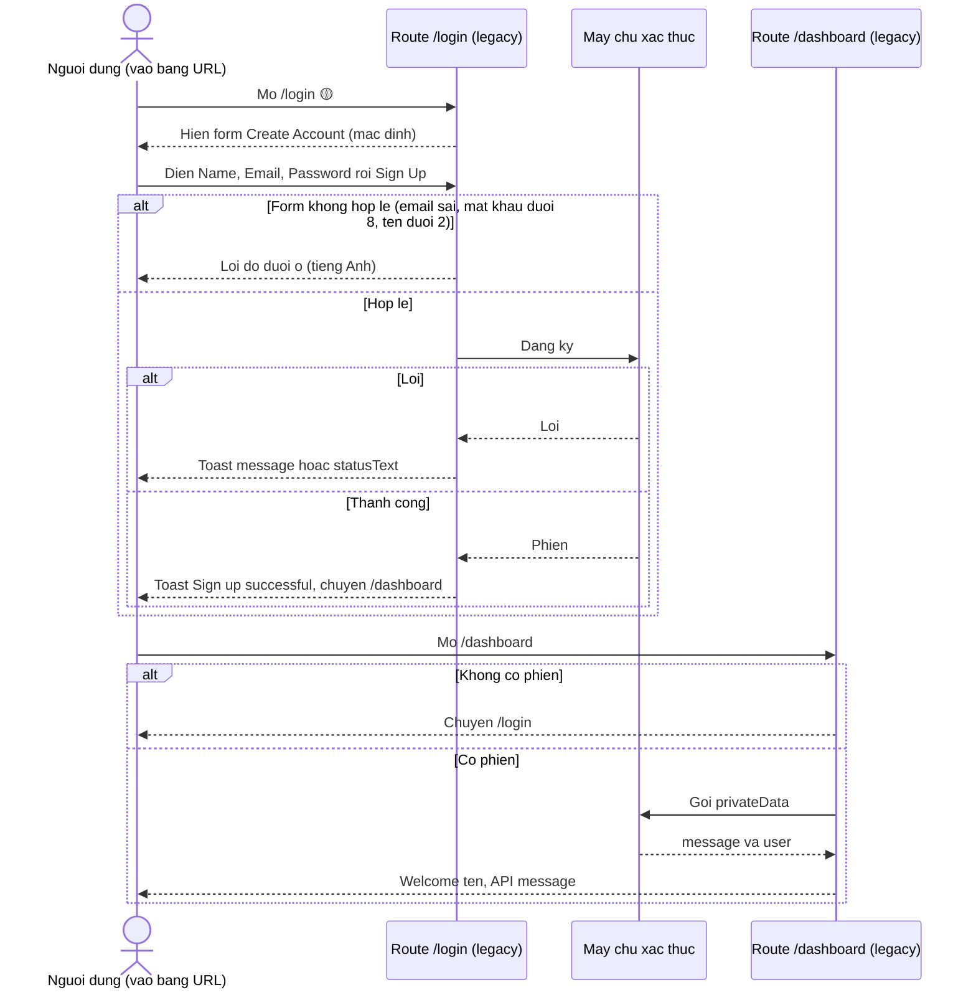
```mermaid
sequenceDiagram
    actor U as Nguoi dung (vao bang URL)
    participant L as Route /login (legacy)
    participant S as May chu xac thuc
    participant D as Route /dashboard (legacy)
    U->>L: Mo /login 🟡
    L-->>U: Hien form Create Account (mac dinh)
    U->>L: Dien Name, Email, Password roi Sign Up
    alt Form khong hop le (email sai, mat khau duoi 8, ten duoi 2)
        L-->>U: Loi do duoi o (tieng Anh)
    else Hop le
        L->>S: Dang ky
        alt Loi
            S-->>L: Loi
            L-->>U: Toast message hoac statusText
        else Thanh cong
            S-->>L: Phien
            L-->>U: Toast Sign up successful, chuyen /dashboard
        end
    end
    U->>D: Mo /dashboard
    alt Khong co phien
        D-->>U: Chuyen /login
    else Co phien
        D->>S: Goi privateData
        S-->>D: message va user
        D-->>U: Welcome ten, API message
    end
```

### Activity — Legacy

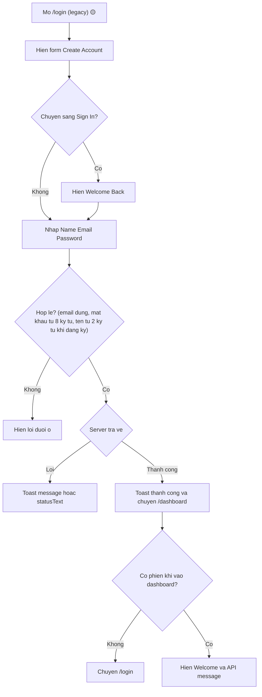
```mermaid
flowchart TD
    A["Mo /login (legacy) 🟡"] --> B["Hien form Create Account"]
    B --> C{"Chuyen sang Sign In?"}
    C -->|Co| C1["Hien Welcome Back"]
    C -->|Khong| D["Nhap Name Email Password"]
    C1 --> D
    D --> E{"Hop le? (email dung, mat khau tu 8 ky tu, ten tu 2 ky tu khi dang ky)"}
    E -->|Khong| E1["Hien loi duoi o"]
    E -->|Co| F{"Server tra ve"}
    F -->|"Loi"| F1["Toast message hoac statusText"]
    F -->|"Thanh cong"| G["Toast thanh cong va chuyen /dashboard"]
    G --> H{"Co phien khi vao dashboard?"}
    H -->|Khong| H1["Chuyen /login"]
    H -->|Co| H2["Hien Welcome va API message"]
```
