# mock-exam — Flows tái lập (reverse)

> Chỉ vẽ bước CÓ trong code. Bước suy đoán chú thích 🔵/🟡. Nguồn tra ở `../reverse-sources.md`; mã lỗi E-... ở Mục 6 của spec.

## Flow 1: Chọn chế độ, giọng và bắt đầu thi

> FR-001..009. Nguồn ✅ [S23: apps/web/src/features/select/components/mode-grid.tsx:15-23] [S23: apps/web/src/features/select/components/pre-exam-card.tsx:28-39]

### Sequence — Chọn chế độ, giọng và bắt đầu thi

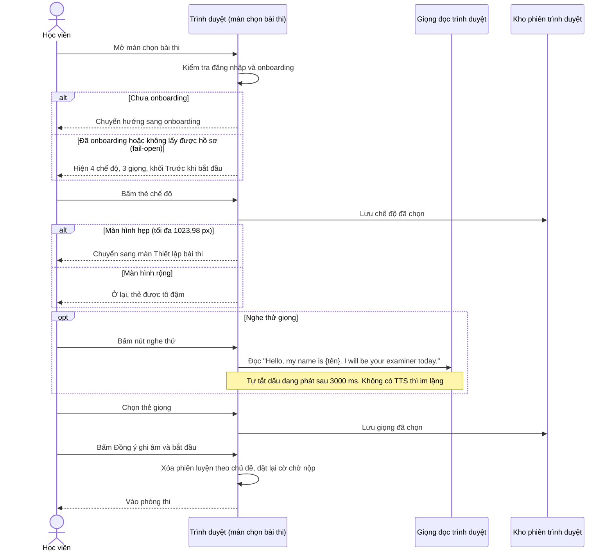
```mermaid
sequenceDiagram
    actor HV as Học viên
    participant W as Trình duyệt (màn chọn bài thi)
    participant TTS as Giọng đọc trình duyệt
    participant ST as Kho phiên trình duyệt
    HV->>W: Mở màn chọn bài thi
    W->>W: Kiểm tra đăng nhập và onboarding
    alt Chưa onboarding
        W-->>HV: Chuyển hướng sang onboarding
    else Đã onboarding hoặc không lấy được hồ sơ (fail-open)
        W-->>HV: Hiện 4 chế độ, 3 giọng, khối Trước khi bắt đầu
    end
    HV->>W: Bấm thẻ chế độ
    W->>ST: Lưu chế độ đã chọn
    alt Màn hình hẹp (tối đa 1023,98 px)
        W-->>HV: Chuyển sang màn Thiết lập bài thi
    else Màn hình rộng
        W-->>HV: Ở lại, thẻ được tô đậm
    end
    opt Nghe thử giọng
        HV->>W: Bấm nút nghe thử
        W->>TTS: Đọc "Hello, my name is {tên}. I will be your examiner today."
        Note over W,TTS: Tự tắt dấu đang phát sau 3000 ms. Không có TTS thì im lặng
    end
    HV->>W: Chọn thẻ giọng
    W->>ST: Lưu giọng đã chọn
    HV->>W: Bấm Đồng ý ghi âm và bắt đầu
    W->>W: Xóa phiên luyện theo chủ đề, đặt lại cờ chờ nộp
    W-->>HV: Vào phòng thi
```

### Activity — Chọn chế độ, giọng và bắt đầu thi

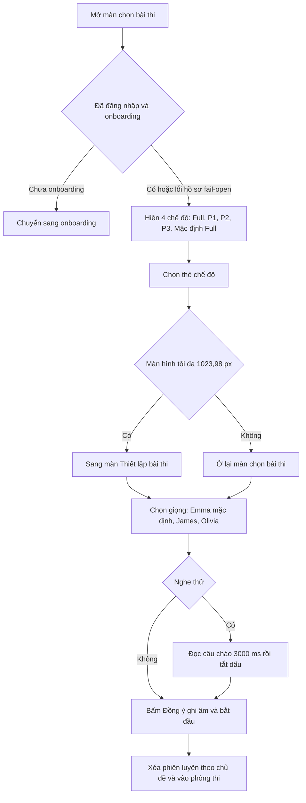
```mermaid
flowchart TD
    A["Mở màn chọn bài thi"] --> B{"Đã đăng nhập và onboarding"}
    B -->|Chưa onboarding| X["Chuyển sang onboarding"]
    B -->|Có hoặc lỗi hồ sơ fail-open| C["Hiện 4 chế độ: Full, P1, P2, P3. Mặc định Full"]
    C --> D["Chọn thẻ chế độ"]
    D --> E{"Màn hình tối đa 1023,98 px"}
    E -->|Có| F["Sang màn Thiết lập bài thi"]
    E -->|Không| G["Ở lại màn chọn bài thi"]
    F --> H["Chọn giọng: Emma mặc định, James, Olivia"]
    G --> H
    H --> I{"Nghe thử"}
    I -->|Có| J["Đọc câu chào 3000 ms rồi tắt dấu"]
    I -->|Không| K["Bấm Đồng ý ghi âm và bắt đầu"]
    J --> K
    K --> L["Xóa phiên luyện theo chủ đề và vào phòng thi"]
```

## Flow 2: Khởi tạo hoặc nối lại lượt thi

> FR-010..016. Nguồn ✅ [S17: apps/web/src/features/exam/use-exam-session.ts:120-181] [S1: packages/api/src/routers/attempt.ts:21-142]

### Sequence — Khởi tạo hoặc nối lại lượt thi

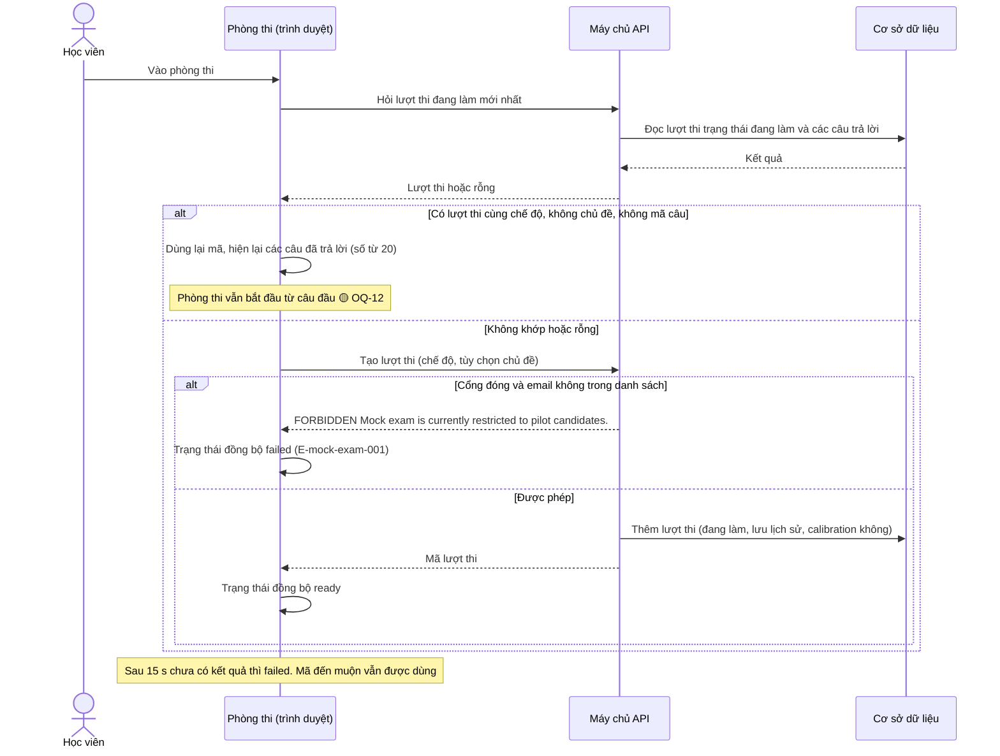
```mermaid
sequenceDiagram
    actor HV as Học viên
    participant W as Phòng thi (trình duyệt)
    participant API as Máy chủ API
    participant DB as Cơ sở dữ liệu
    HV->>W: Vào phòng thi
    W->>API: Hỏi lượt thi đang làm mới nhất
    API->>DB: Đọc lượt thi trạng thái đang làm và các câu trả lời
    DB-->>API: Kết quả
    API-->>W: Lượt thi hoặc rỗng
    alt Có lượt thi cùng chế độ, không chủ đề, không mã câu
        W->>W: Dùng lại mã, hiện lại các câu đã trả lời (số từ 20)
        Note over W: Phòng thi vẫn bắt đầu từ câu đầu 🟡 OQ-12
    else Không khớp hoặc rỗng
        W->>API: Tạo lượt thi (chế độ, tùy chọn chủ đề)
        alt Cổng đóng và email không trong danh sách
            API-->>W: FORBIDDEN Mock exam is currently restricted to pilot candidates.
            W->>W: Trạng thái đồng bộ failed (E-mock-exam-001)
        else Được phép
            API->>DB: Thêm lượt thi (đang làm, lưu lịch sử, calibration không)
            API-->>W: Mã lượt thi
            W->>W: Trạng thái đồng bộ ready
        end
    end
    Note over W: Sau 15 s chưa có kết quả thì failed. Mã đến muộn vẫn được dùng
```

### Activity — Khởi tạo hoặc nối lại lượt thi

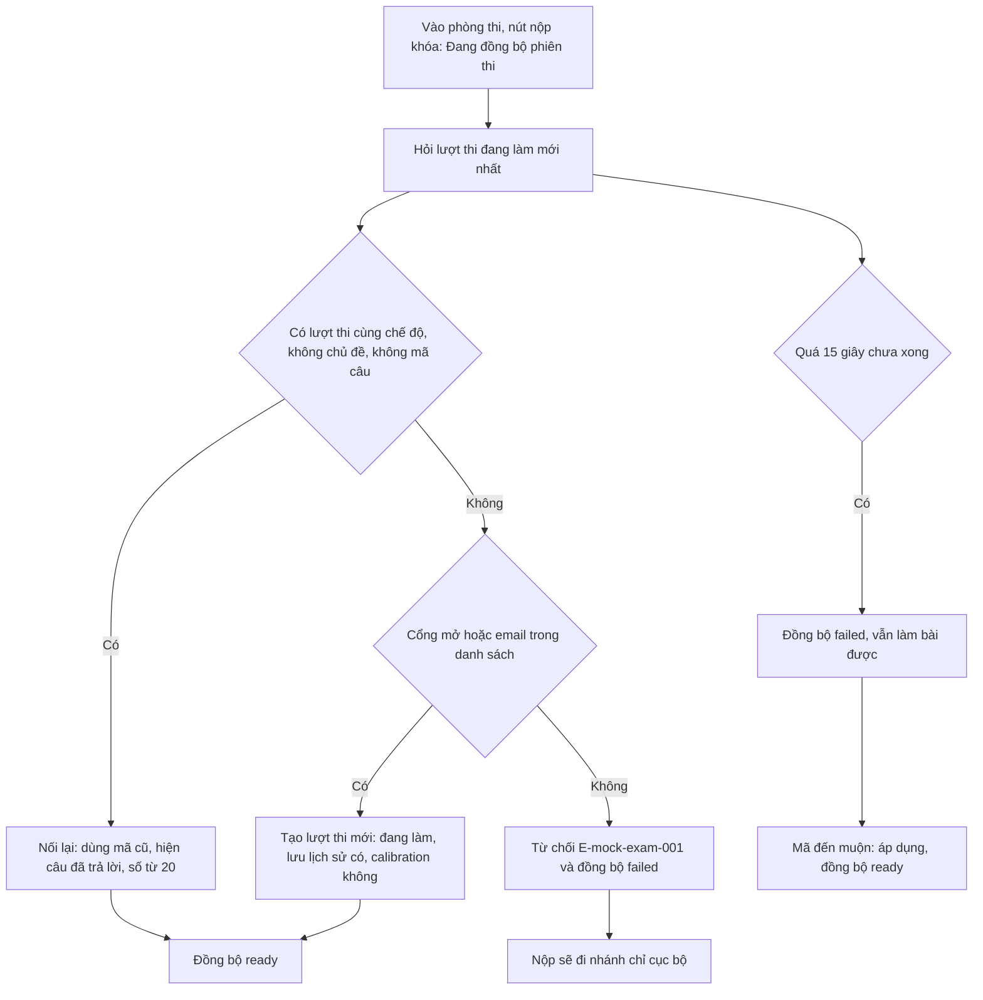
```mermaid
flowchart TD
    A["Vào phòng thi, nút nộp khóa: Đang đồng bộ phiên thi"] --> B["Hỏi lượt thi đang làm mới nhất"]
    B --> C{"Có lượt thi cùng chế độ, không chủ đề, không mã câu"}
    C -->|Có| D["Nối lại: dùng mã cũ, hiện câu đã trả lời, số từ 20"]
    C -->|Không| E{"Cổng mở hoặc email trong danh sách"}
    E -->|Không| F["Từ chối E-mock-exam-001 và đồng bộ failed"]
    E -->|Có| G["Tạo lượt thi mới: đang làm, lưu lịch sử có, calibration không"]
    G --> H["Đồng bộ ready"]
    D --> H
    B --> T{"Quá 15 giây chưa xong"}
    T -->|Có| F2["Đồng bộ failed, vẫn làm bài được"]
    F2 --> L["Mã đến muộn: áp dụng, đồng bộ ready"]
    F --> M["Nộp sẽ đi nhánh chỉ cục bộ"]
```

## Flow 3: Làm một câu hỏi trong phòng thi

> FR-017..029. Nguồn ✅ [S17: apps/web/src/features/exam/use-exam-session.ts:191-372]

### Sequence — Làm một câu hỏi trong phòng thi

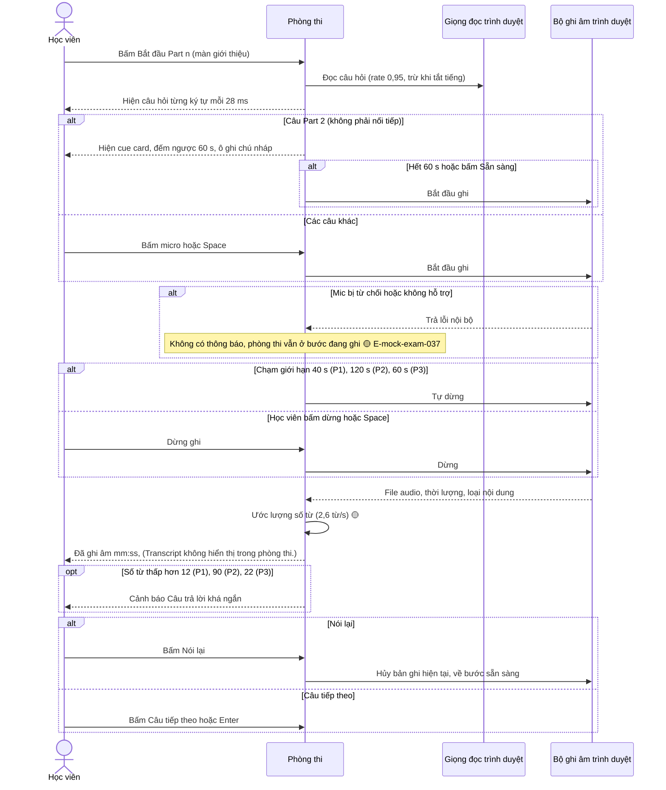
```mermaid
sequenceDiagram
    actor HV as Học viên
    participant W as Phòng thi
    participant TTS as Giọng đọc trình duyệt
    participant REC as Bộ ghi âm trình duyệt
    HV->>W: Bấm Bắt đầu Part n (màn giới thiệu)
    W->>TTS: Đọc câu hỏi (rate 0,95, trừ khi tắt tiếng)
    W-->>HV: Hiện câu hỏi từng ký tự mỗi 28 ms
    alt Câu Part 2 (không phải nối tiếp)
        W-->>HV: Hiện cue card, đếm ngược 60 s, ô ghi chú nháp
        alt Hết 60 s hoặc bấm Sẵn sàng
            W->>REC: Bắt đầu ghi
        end
    else Các câu khác
        HV->>W: Bấm micro hoặc Space
        W->>REC: Bắt đầu ghi
    end
    alt Mic bị từ chối hoặc không hỗ trợ
        REC-->>W: Trả lỗi nội bộ
        Note over W: Không có thông báo, phòng thi vẫn ở bước đang ghi 🟡 E-mock-exam-037
    end
    alt Chạm giới hạn 40 s (P1), 120 s (P2), 60 s (P3)
        W->>REC: Tự dừng
    else Học viên bấm dừng hoặc Space
        HV->>W: Dừng ghi
        W->>REC: Dừng
    end
    REC-->>W: File audio, thời lượng, loại nội dung
    W->>W: Ước lượng số từ (2,6 từ/s) 🟡
    W-->>HV: Đã ghi âm mm:ss, (Transcript không hiển thị trong phòng thi.)
    opt Số từ thấp hơn 12 (P1), 90 (P2), 22 (P3)
        W-->>HV: Cảnh báo Câu trả lời khá ngắn
    end
    alt Nói lại
        HV->>W: Bấm Nói lại
        W->>REC: Hủy bản ghi hiện tại, về bước sẵn sàng
    else Câu tiếp theo
        HV->>W: Bấm Câu tiếp theo hoặc Enter
    end
```

### Activity — Làm một câu hỏi trong phòng thi

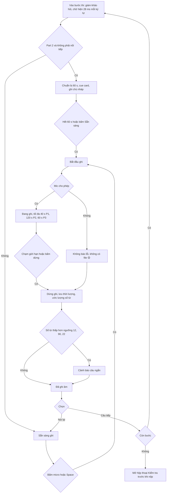
```mermaid
flowchart TD
    A["Vào bước thi: giám khảo hỏi, chữ hiện 28 ms mỗi ký tự"] --> B{"Part 2 và không phải nối tiếp"}
    B -->|Có| C["Chuẩn bị 60 s, cue card, ghi chú nháp"]
    B -->|Không| D["Sẵn sàng ghi"]
    C --> E{"Hết 60 s hoặc bấm Sẵn sàng"}
    E -->|Có| F["Bắt đầu ghi"]
    D --> G{"Bấm micro hoặc Space"}
    G -->|Có| F
    F --> H{"Mic cho phép"}
    H -->|Không| I["Không báo lỗi, không có file 🟡"]
    H -->|Có| J["Đang ghi, tối đa 40 s P1, 120 s P2, 60 s P3"]
    J --> K{"Chạm giới hạn hoặc bấm dừng"}
    K -->|Có| L["Dừng ghi, lưu thời lượng, ước lượng số từ"]
    I --> L
    L --> M{"Số từ thấp hơn ngưỡng 12, 90, 22"}
    M -->|Có| N["Cảnh báo câu ngắn"]
    M -->|Không| O["Đã ghi âm"]
    N --> O
    O --> P{"Chọn"}
    P -->|Nói lại| D
    P -->|Câu tiếp| Q{"Còn bước"}
    Q -->|Có| A
    Q -->|Không| R["Mở hộp thoại Kiểm tra trước khi nộp"]
```

## Flow 4: Tải audio lên, lưu offline, thắng thua theo phiên bản

> FR-030..039. Nguồn ✅ [S18: apps/web/src/features/exam/answer-uploads.ts:242-268] [S13: apps/server/src/index.ts:79-299]

### Sequence — Tải audio lên và lưu offline

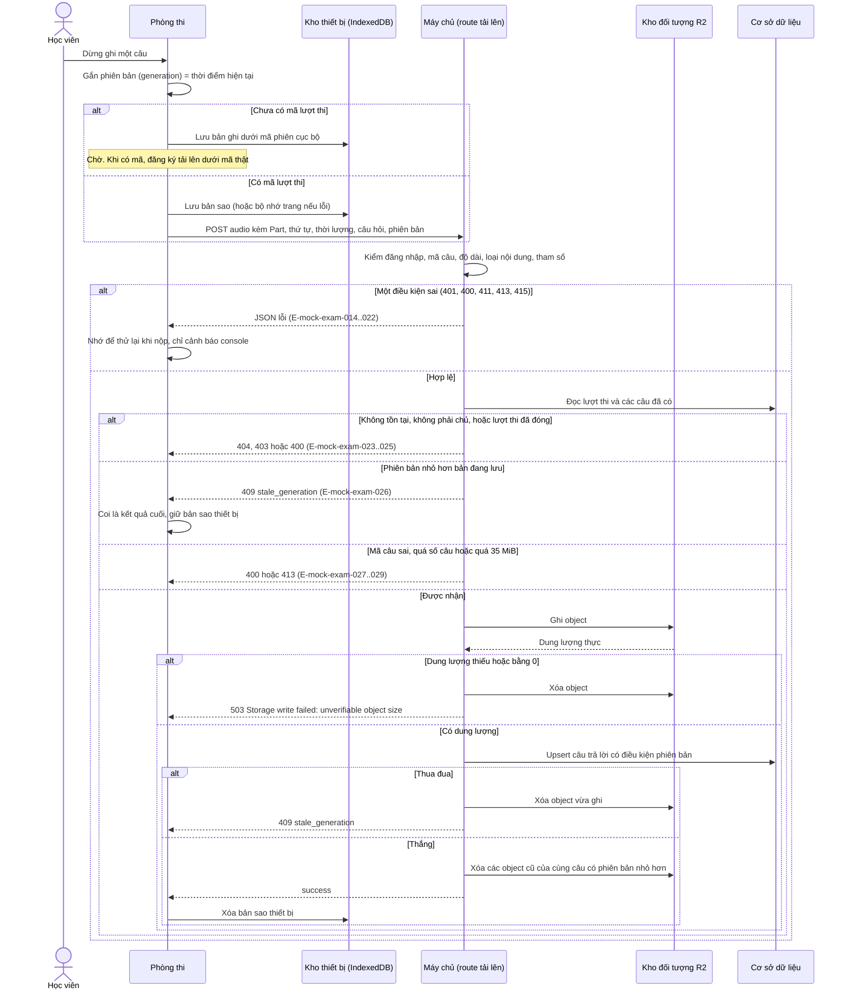
```mermaid
sequenceDiagram
    actor HV as Học viên
    participant W as Phòng thi
    participant IDB as Kho thiết bị (IndexedDB)
    participant API as Máy chủ (route tải lên)
    participant R2 as Kho đối tượng R2
    participant DB as Cơ sở dữ liệu
    HV->>W: Dừng ghi một câu
    W->>W: Gắn phiên bản (generation) = thời điểm hiện tại
    alt Chưa có mã lượt thi
        W->>IDB: Lưu bản ghi dưới mã phiên cục bộ
        Note over W: Chờ. Khi có mã, đăng ký tải lên dưới mã thật
    else Có mã lượt thi
        W->>IDB: Lưu bản sao (hoặc bộ nhớ trang nếu lỗi)
        W->>API: POST audio kèm Part, thứ tự, thời lượng, câu hỏi, phiên bản
    end
    API->>API: Kiểm đăng nhập, mã câu, độ dài, loại nội dung, tham số
    alt Một điều kiện sai (401, 400, 411, 413, 415)
        API-->>W: JSON lỗi (E-mock-exam-014..022)
        W->>W: Nhớ để thử lại khi nộp, chỉ cảnh báo console
    else Hợp lệ
        API->>DB: Đọc lượt thi và các câu đã có
        alt Không tồn tại, không phải chủ, hoặc lượt thi đã đóng
            API-->>W: 404, 403 hoặc 400 (E-mock-exam-023..025)
        else Phiên bản nhỏ hơn bản đang lưu
            API-->>W: 409 stale_generation (E-mock-exam-026)
            W->>W: Coi là kết quả cuối, giữ bản sao thiết bị
        else Mã câu sai, quá số câu hoặc quá 35 MiB
            API-->>W: 400 hoặc 413 (E-mock-exam-027..029)
        else Được nhận
            API->>R2: Ghi object
            R2-->>API: Dung lượng thực
            alt Dung lượng thiếu hoặc bằng 0
                API->>R2: Xóa object
                API-->>W: 503 Storage write failed: unverifiable object size
            else Có dung lượng
                API->>DB: Upsert câu trả lời có điều kiện phiên bản
                alt Thua đua
                    API->>R2: Xóa object vừa ghi
                    API-->>W: 409 stale_generation
                else Thắng
                    API->>R2: Xóa các object cũ của cùng câu có phiên bản nhỏ hơn
                    API-->>W: success
                    W->>IDB: Xóa bản sao thiết bị
                end
            end
        end
    end
```

### Activity — Tải audio lên và lưu offline

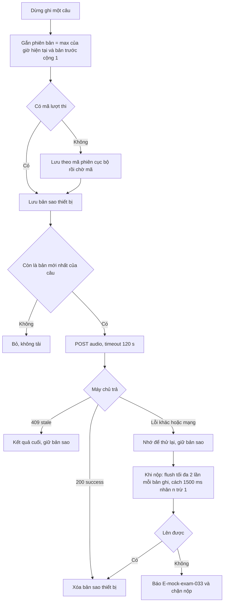
```mermaid
flowchart TD
    A["Dừng ghi một câu"] --> B["Gắn phiên bản = max của giờ hiện tại và bản trước cộng 1"]
    B --> C{"Có mã lượt thi"}
    C -->|Không| D["Lưu theo mã phiên cục bộ rồi chờ mã"]
    C -->|Có| E["Lưu bản sao thiết bị"]
    D --> E
    E --> F{"Còn là bản mới nhất của câu"}
    F -->|Không| G["Bỏ, không tải"]
    F -->|Có| H["POST audio, timeout 120 s"]
    H --> I{"Máy chủ trả"}
    I -->|200 success| J["Xóa bản sao thiết bị"]
    I -->|409 stale| K["Kết quả cuối, giữ bản sao"]
    I -->|Lỗi khác hoặc mạng| L["Nhớ để thử lại, giữ bản sao"]
    L --> M["Khi nộp: flush tối đa 2 lần mỗi bản ghi, cách 1500 ms nhân n trừ 1"]
    M --> N{"Lên được"}
    N -->|Có| J
    N -->|Không| O["Báo E-mock-exam-033 và chặn nộp"]
```

## Flow 5: Kiểm tra trước khi nộp và nộp bài

> FR-040..047. Nguồn ✅ [S20: apps/web/src/features/exam/exam-screen.tsx:60-176] [S1: packages/api/src/routers/attempt.ts:203-304]

### Sequence — Kiểm tra trước khi nộp và nộp bài

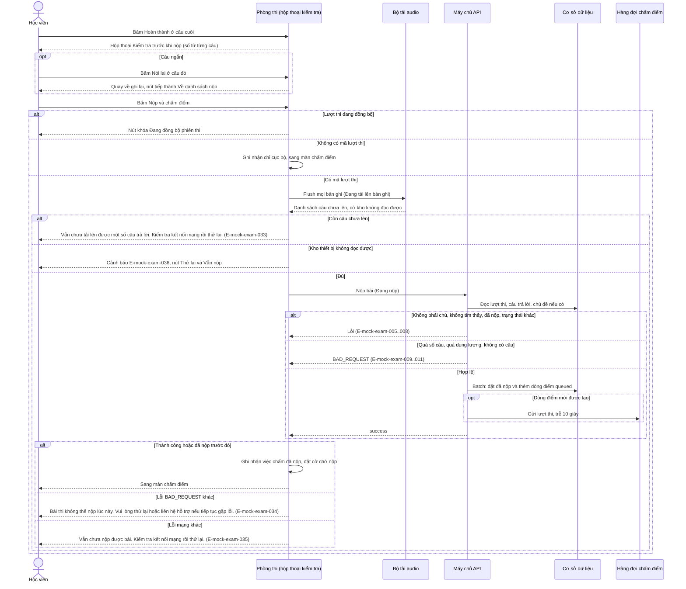
```mermaid
sequenceDiagram
    actor HV as Học viên
    participant W as Phòng thi (hộp thoại kiểm tra)
    participant UP as Bộ tải audio
    participant API as Máy chủ API
    participant DB as Cơ sở dữ liệu
    participant Q as Hàng đợi chấm điểm
    HV->>W: Bấm Hoàn thành ở câu cuối
    W-->>HV: Hộp thoại Kiểm tra trước khi nộp (số từ từng câu)
    opt Câu ngắn
        HV->>W: Bấm Nói lại ở câu đó
        W-->>HV: Quay về ghi lại, nút tiếp thành Về danh sách nộp
    end
    HV->>W: Bấm Nộp và chấm điểm
    alt Lượt thi đang đồng bộ
        W-->>HV: Nút khóa Đang đồng bộ phiên thi
    else Không có mã lượt thi
        W->>W: Ghi nhận chỉ cục bộ, sang màn chấm điểm
    else Có mã lượt thi
        W->>UP: Flush mọi bản ghi (Đang tải lên bản ghi)
        UP-->>W: Danh sách câu chưa lên, cờ kho không đọc được
        alt Còn câu chưa lên
            W-->>HV: Vẫn chưa tải lên được một số câu trả lời. Kiểm tra kết nối mạng rồi thử lại. (E-mock-exam-033)
        else Kho thiết bị không đọc được
            W-->>HV: Cảnh báo E-mock-exam-036, nút Thử lại và Vẫn nộp
        else Đủ
            W->>API: Nộp bài (Đang nộp)
            API->>DB: Đọc lượt thi, câu trả lời, chủ đề nếu có
            alt Không phải chủ, không tìm thấy, đã nộp, trạng thái khác
                API-->>W: Lỗi (E-mock-exam-005..008)
            else Quá số câu, quá dung lượng, không có câu
                API-->>W: BAD_REQUEST (E-mock-exam-009..011)
            else Hợp lệ
                API->>DB: Batch: đặt đã nộp và thêm dòng điểm queued
                opt Dòng điểm mới được tạo
                    API->>Q: Gửi lượt thi, trễ 10 giây
                end
                API-->>W: success
            end
            alt Thành công hoặc đã nộp trước đó
                W->>W: Ghi nhận việc chấm đã nộp, đặt cờ chờ nộp
                W-->>HV: Sang màn chấm điểm
            else Lỗi BAD_REQUEST khác
                W-->>HV: Bài thi không thể nộp lúc này. Vui lòng thử lại hoặc liên hệ hỗ trợ nếu tiếp tục gặp lỗi. (E-mock-exam-034)
            else Lỗi mạng khác
                W-->>HV: Vẫn chưa nộp được bài. Kiểm tra kết nối mạng rồi thử lại. (E-mock-exam-035)
            end
        end
    end
```

### Activity — Kiểm tra trước khi nộp và nộp bài

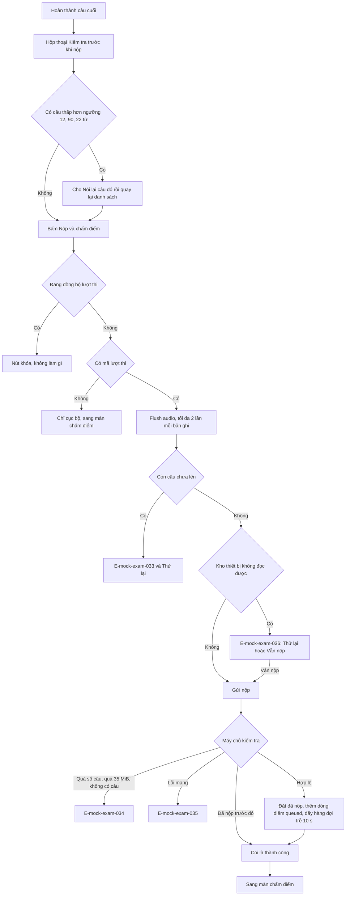
```mermaid
flowchart TD
    A["Hoàn thành câu cuối"] --> B["Hộp thoại Kiểm tra trước khi nộp"]
    B --> C{"Có câu thấp hơn ngưỡng 12, 90, 22 từ"}
    C -->|Có| D["Cho Nói lại câu đó rồi quay lại danh sách"]
    C -->|Không| E["Bấm Nộp và chấm điểm"]
    D --> E
    E --> F{"Đang đồng bộ lượt thi"}
    F -->|Có| X1["Nút khóa, không làm gì"]
    F -->|Không| G{"Có mã lượt thi"}
    G -->|Không| H["Chỉ cục bộ, sang màn chấm điểm"]
    G -->|Có| I["Flush audio, tối đa 2 lần mỗi bản ghi"]
    I --> J{"Còn câu chưa lên"}
    J -->|Có| K["E-mock-exam-033 và Thử lại"]
    J -->|Không| L{"Kho thiết bị không đọc được"}
    L -->|Có| M["E-mock-exam-036: Thử lại hoặc Vẫn nộp"]
    L -->|Không| N["Gửi nộp"]
    M -->|Vẫn nộp| N
    N --> O{"Máy chủ kiểm tra"}
    O -->|Đã nộp trước đó| P["Coi là thành công"]
    O -->|Quá số câu, quá 35 MiB, không có câu| Q["E-mock-exam-034"]
    O -->|Lỗi mạng| R["E-mock-exam-035"]
    O -->|Hợp lệ| S["Đặt đã nộp, thêm dòng điểm queued, đẩy hàng đợi trễ 10 s"]
    S --> P
    P --> T["Sang màn chấm điểm"]
```

## Flow 6: Thoát phòng thi giữa chừng

> FR-047, FR-048. Nguồn ✅ [S20: apps/web/src/features/exam/exam-screen.tsx:161-184] [S21: apps/web/src/features/exam/components/exit-exam-modal.tsx:14-20]

### Sequence — Thoát phòng thi giữa chừng

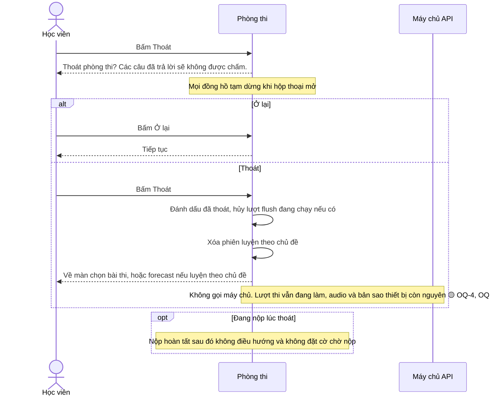
```mermaid
sequenceDiagram
    actor HV as Học viên
    participant W as Phòng thi
    participant API as Máy chủ API
    HV->>W: Bấm Thoát
    W-->>HV: Thoát phòng thi? Các câu đã trả lời sẽ không được chấm.
    Note over W: Mọi đồng hồ tạm dừng khi hộp thoại mở
    alt Ở lại
        HV->>W: Bấm Ở lại
        W-->>HV: Tiếp tục
    else Thoát
        HV->>W: Bấm Thoát
        W->>W: Đánh dấu đã thoát, hủy lượt flush đang chạy nếu có
        W->>W: Xóa phiên luyện theo chủ đề
        W-->>HV: Về màn chọn bài thi, hoặc forecast nếu luyện theo chủ đề
        Note over W,API: Không gọi máy chủ. Lượt thi vẫn đang làm, audio và bản sao thiết bị còn nguyên 🟡 OQ-4, OQ-7
    end
    opt Đang nộp lúc thoát
        Note over W: Nộp hoàn tất sau đó không điều hướng và không đặt cờ chờ nộp
    end
```

### Activity — Thoát phòng thi giữa chừng

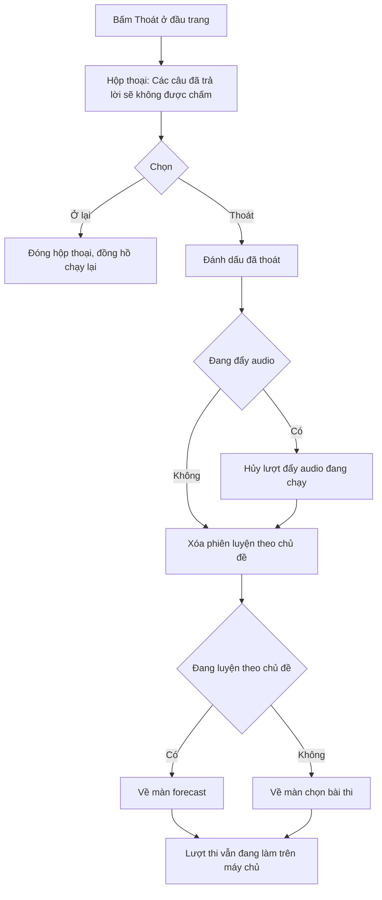
```mermaid
flowchart TD
    A["Bấm Thoát ở đầu trang"] --> B["Hộp thoại: Các câu đã trả lời sẽ không được chấm"]
    B --> C{"Chọn"}
    C -->|Ở lại| D["Đóng hộp thoại, đồng hồ chạy lại"]
    C -->|Thoát| E["Đánh dấu đã thoát"]
    E --> F{"Đang đẩy audio"}
    F -->|Có| G["Hủy lượt đẩy audio đang chạy"]
    F -->|Không| H["Xóa phiên luyện theo chủ đề"]
    G --> H
    H --> I{"Đang luyện theo chủ đề"}
    I -->|Có| J["Về màn forecast"]
    I -->|Không| K["Về màn chọn bài thi"]
    J --> L["Lượt thi vẫn đang làm trên máy chủ"]
    K --> L
```

## Flow 7: Câu hỏi nối tiếp bằng AI (chưa nối vào phòng thi) 🟡

> FR-049..051. Máy chủ có sẵn nhưng không có nơi gọi ở client (xem OQ-2, N-1). Nguồn ✅ [S1: packages/api/src/routers/attempt.ts:144-201] [S5: packages/api/src/exam/follow-up.ts:24-89]

### Sequence — Câu hỏi nối tiếp bằng AI

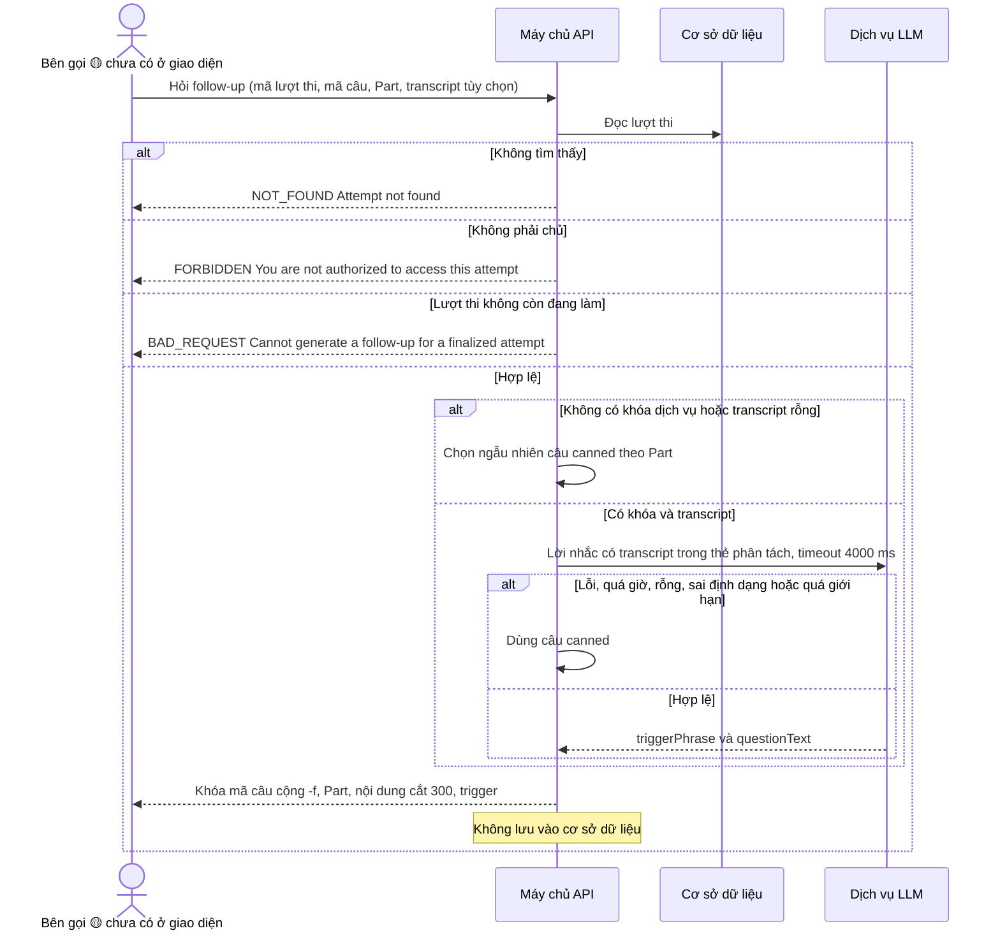
```mermaid
sequenceDiagram
    actor C as Bên gọi 🟡 chưa có ở giao diện
    participant API as Máy chủ API
    participant DB as Cơ sở dữ liệu
    participant LLM as Dịch vụ LLM
    C->>API: Hỏi follow-up (mã lượt thi, mã câu, Part, transcript tùy chọn)
    API->>DB: Đọc lượt thi
    alt Không tìm thấy
        API-->>C: NOT_FOUND Attempt not found
    else Không phải chủ
        API-->>C: FORBIDDEN You are not authorized to access this attempt
    else Lượt thi không còn đang làm
        API-->>C: BAD_REQUEST Cannot generate a follow-up for a finalized attempt
    else Hợp lệ
        alt Không có khóa dịch vụ hoặc transcript rỗng
            API->>API: Chọn ngẫu nhiên câu canned theo Part
        else Có khóa và transcript
            API->>LLM: Lời nhắc có transcript trong thẻ phân tách, timeout 4000 ms
            alt Lỗi, quá giờ, rỗng, sai định dạng hoặc quá giới hạn
                API->>API: Dùng câu canned
            else Hợp lệ
                LLM-->>API: triggerPhrase và questionText
            end
        end
        API-->>C: Khóa mã câu cộng -f, Part, nội dung cắt 300, trigger
        Note over API: Không lưu vào cơ sở dữ liệu
    end
```

### Activity — Câu hỏi nối tiếp bằng AI

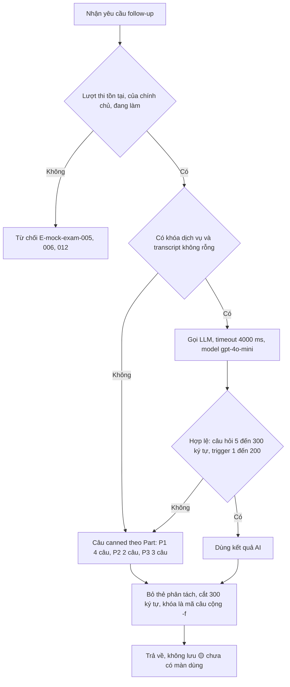
```mermaid
flowchart TD
    A["Nhận yêu cầu follow-up"] --> B{"Lượt thi tồn tại, của chính chủ, đang làm"}
    B -->|Không| X["Từ chối E-mock-exam-005, 006, 012"]
    B -->|Có| C{"Có khóa dịch vụ và transcript không rỗng"}
    C -->|Không| F["Câu canned theo Part: P1 4 câu, P2 2 câu, P3 3 câu"]
    C -->|Có| D["Gọi LLM, timeout 4000 ms, model gpt-4o-mini"]
    D --> E{"Hợp lệ: câu hỏi 5 đến 300 ký tự, trigger 1 đến 200"}
    E -->|Không| F
    E -->|Có| G["Dùng kết quả AI"]
    F --> H["Bỏ thẻ phân tách, cắt 300 ký tự, khóa là mã câu cộng -f"]
    G --> H
    H --> I["Trả về, không lưu 🟡 chưa có màn dùng"]
```

## Flow 8: Tải audio về

> FR-052, FR-053. Nguồn ✅ [S13: apps/server/src/index.ts:301-394] [S32: packages/api/src/auth-utils.ts:23-37]

### Sequence — Tải audio về

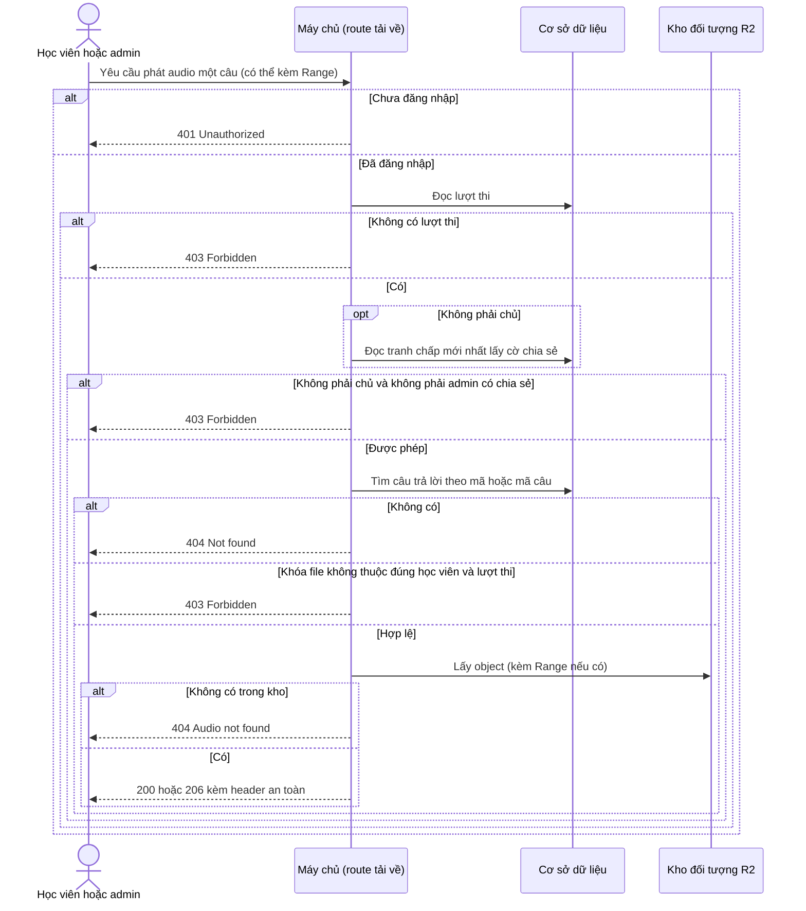
```mermaid
sequenceDiagram
    actor U as Học viên hoặc admin
    participant API as Máy chủ (route tải về)
    participant DB as Cơ sở dữ liệu
    participant R2 as Kho đối tượng R2
    U->>API: Yêu cầu phát audio một câu (có thể kèm Range)
    alt Chưa đăng nhập
        API-->>U: 401 Unauthorized
    else Đã đăng nhập
        API->>DB: Đọc lượt thi
        alt Không có lượt thi
            API-->>U: 403 Forbidden
        else Có
            opt Không phải chủ
                API->>DB: Đọc tranh chấp mới nhất lấy cờ chia sẻ
            end
            alt Không phải chủ và không phải admin có chia sẻ
                API-->>U: 403 Forbidden
            else Được phép
                API->>DB: Tìm câu trả lời theo mã hoặc mã câu
                alt Không có
                    API-->>U: 404 Not found
                else Khóa file không thuộc đúng học viên và lượt thi
                    API-->>U: 403 Forbidden
                else Hợp lệ
                    API->>R2: Lấy object (kèm Range nếu có)
                    alt Không có trong kho
                        API-->>U: 404 Audio not found
                    else Có
                        API-->>U: 200 hoặc 206 kèm header an toàn
                    end
                end
            end
        end
    end
```

### Activity — Tải audio về

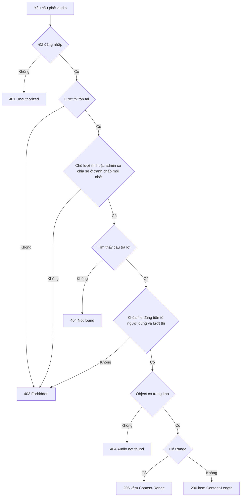
```mermaid
flowchart TD
    A["Yêu cầu phát audio"] --> B{"Đã đăng nhập"}
    B -->|Không| X1["401 Unauthorized"]
    B -->|Có| C{"Lượt thi tồn tại"}
    C -->|Không| X2["403 Forbidden"]
    C -->|Có| D{"Chủ lượt thi hoặc admin có chia sẻ ở tranh chấp mới nhất"}
    D -->|Không| X2
    D -->|Có| E{"Tìm thấy câu trả lời"}
    E -->|Không| X3["404 Not found"]
    E -->|Có| F{"Khóa file đúng tiền tố người dùng và lượt thi"}
    F -->|Không| X2
    F -->|Có| G{"Object có trong kho"}
    G -->|Không| X4["404 Audio not found"]
    G -->|Có| H{"Có Range"}
    H -->|Có| I["206 kèm Content-Range"]
    H -->|Không| J["200 kèm Content-Length"]
```
